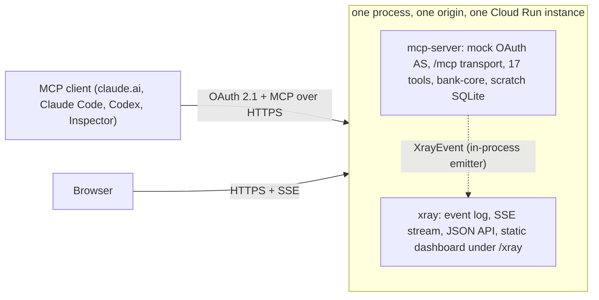

# Glass Bank

A public remote MCP server for a fictional bank, plus an X-ray dashboard that shows in real time everything the server observes about a session: which tools were listed and called, with which arguments and rationale, what came back, how long it took, the auth and session facts behind it, and which of five actors - client app, model, this server, our engine, this page - authored each value.

Every bank operation is mocked. Data is generated deterministically from a seed and lives in memory, with a per-grant SQLite scratch database for the Ramp-style "load, then SQL" pattern. The tool surface, scope model and OAuth shape follow Ramp's public MCP work; the observability layer is ours.

**State (2026-09-26):** code complete, `npm run check` green (1295 tests), contracts v0.5, source at https://github.com/frbarreto/glassbank, **not deployed**. It runs on a laptop behind a cloudflared tunnel; Codex and ChatGPT have connected through it, no claude.ai account has yet. Target: Cloud Run at `glassbank-mcp.abovethefog.app`, deployed by GitHub Actions. See [docs/BUILD_PLAN.md](docs/BUILD_PLAN.md) for what remains.

## Try it

```bash
npm ci
npm run build && npm start        # http://localhost:8080  (/mcp, /authorize, /.well-known/*, /xray)
npm run login -- --write          # opens the mock login and consent pages, writes .glass-bank-token.json
npm run e2e                       # 151 scripted checks: OAuth, read flow, write flow, step-up, dashboard API
```

Open `http://localhost:8080/xray/?fixture=1` to see the dashboard replay a recorded session, or connect a real MCP client to `http://localhost:8080/mcp` and ask it for `xray_get_session_link`. [docs/LOCAL_TESTING.md](docs/LOCAL_TESTING.md) is the full walkthrough; [infra/local/cloudflared.md](infra/local/cloudflared.md) exposes the laptop to a remote client.

## How it fits together



## Documents

| Document | Answers |
|---|---|
| [CLAUDE.md](CLAUDE.md) | Conventions, invariants, verified commands, and the full document index |
| [docs/LOCAL_TESTING.md](docs/LOCAL_TESTING.md) | Running it and driving it end to end |
| [docs/ARCHITECTURE.md](docs/ARCHITECTURE.md) | Blocks, stack, auth sequence, decisions (ADR-x) |
| [docs/TOOL_CATALOG.md](docs/TOOL_CATALOG.md), [docs/XRAY_EVENT_MODEL.md](docs/XRAY_EVENT_MODEL.md) | The 17 tools; the event contract and dashboard |
| [docs/DEPLOYMENT.md](docs/DEPLOYMENT.md) | Cloud Run `mcp-bank` in `lake-fraude` / `us-central1`, operations, env knobs |
| [docs/blocks/](docs/blocks/) | One page per block |
| [docs/RAMP_REFERENCE.md](docs/RAMP_REFERENCE.md), [docs/ASSUMPTIONS.md](docs/ASSUMPTIONS.md) | What was copied from Ramp; numbered assumptions and decisions |

MIT licensed; Ramp's notice and the copied fragments are listed in [THIRD_PARTY_NOTICES.md](THIRD_PARTY_NOTICES.md). Everything in the repository is in English.
