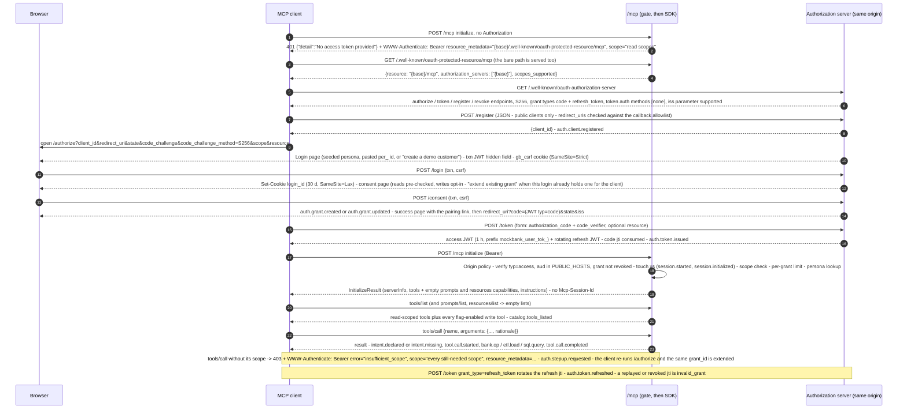

# Architecture

Glass Bank is a public remote MCP server for a fictional bank plus a live X-ray dashboard: one npm package, one Node process, one origin. Companions: [TOOL_CATALOG.md](TOOL_CATALOG.md), [XRAY_EVENT_MODEL.md](XRAY_EVENT_MODEL.md), [DEPLOYMENT.md](DEPLOYMENT.md), [REPO_LAYOUT.md](REPO_LAYOUT.md), [ASSUMPTIONS.md](ASSUMPTIONS.md) (`A-xx`, `D-x`) and `docs/blocks/<block>.md`. `ADR-x` ids are defined in section 8.

## 1. Design thesis

- **The event contract is the primary interface.** Every observable fact is a typed, append-only `XrayEvent` (`src/contracts/events.ts`); `auth`, `mcp`, `tools`, `etl` and `bank-core` produce, the dashboard consumes.
- **Identity is designed for correlation.** The OAuth `grant_id` is inside every token and on every event; `login_id` groups the grants of one browser so the X-ray survives step-ups, reconnects and re-added connectors.
- **Intent is captured explicitly.** Every tool carries Ramp's `rationale`: required in the published schema, lenient server-side (`intent.declared` / `intent.missing`); a classifier adds `intent.inferred`, always labelled inferred.
- **Ramp's tool grammar plus the guardrails its OSS server lacks.** `load_*` -> `process_data` -> `execute_query` -> `clear_table`, scope-gated listing, two guarded writes; model-authored SQL runs in a killable process, every store is capped and rate-limited, and the service is one pinned instance because state is in-process.

## 2. Components

Two logical micro-apps share one process and one origin (ADR-6): **mcp-server** = `auth` + `mcp` + `tools` + `etl` + `bank-core`; **xray** = `xray` + `dashboard`. They share only `contracts`. `src/composition.ts` builds the blocks in dependency order (`bank-core` -> `auth` -> `xray` -> `etl` -> `tools` -> `mcp`) and injects everything; `src/app.ts` mounts `auth` at `/`, `mcp` at `/mcp`, then the X-ray router and the static dashboard at `/xray`. Import rules are enforced by `eslint.config.js` and `test/import-boundaries.test.ts`: a block imports only `src/contracts` and itself, `mcp` may also import `tools`, the app files import everything. Only `src/mcp` imports the MCP SDK, only `src/auth` and `src/xray` import `jose`, only `src/etl`, `src/xray` and `src/auth` import `better-sqlite3`.

| Block | Directory | Responsibility | Emits |
|---|---|---|---|
| contracts | `src/contracts/` | Append-only types and zod schemas (v0.5): events, tool catalog, scopes, `BankCore` / `ScratchDb`, `AuthContext` / `ToolContext`, JWT claims, OAuth and X-ray routes, feature flags. No I/O. | none |
| bank-core | `src/bank-core/` | Deterministic seed dataset per persona, copy-on-write overlay per login, paginated lists, card lock/unlock, transfer preview and confirm, audit entries. No HTTP, no SQL. | `bank.*` |
| etl | `src/etl/` | Port of Ramp's `memory_db.py`: one `:memory:` SQLite per grant inside a forked `sql-runner.ts` (pool in `runner-pool.ts`), token scan in `sql-text.ts`, row, table and database caps, TTL and LRU eviction. | `etl.*`, `sql.*` |
| tools | `src/tools/` | The 17 handlers, the listing rule, rationale extraction, the availability table, the intent classifier. Pure functions of `(ToolContext, args)`. | `intent.*` |
| mcp | `src/mcp/` | Stateless Streamable HTTP at `/mcp`: 405 for GET and DELETE, Origin policy, bearer gate (`gate.ts`), `xs` sessions (`sessions.ts`), per-grant `tools/call` limit, one low-level SDK `Server` per request (`transport.ts`). | `http.*`, `session.*`, `catalog.*`, `tool.*`, `protocol.*`, `auth.stepup.requested` |
| auth | `src/auth/` | Hand-rolled OAuth 2.1 authorization server and verifier: RFC 8414 and 9728 metadata, DCR persisted to `AUTH_DB_PATH`, `/authorize` -> `/login` -> `/consent` pages on a `txn` JWT, `/token`, `/revoke`, rate limits, `verifyAccessToken`. | `auth.*` (server side) |
| xray | `src/xray/` | Emitter, redaction, ring buffer, SQLite WAL log at `XRAY_DB_PATH`, read model, SSE stream, pairing codes, viewer cookie; serves `/xray/s/:code` and `/xray/api/*`. | `xray.*`, `server.*` |
| dashboard | `public/` | Vanilla-JS SPA (flat files, `panel-*.js`): `EventSource` client with reconnect, panels over a reducer, `?fixture=1` replay of `test/fixtures/events.jsonl`. Talks HTTP only. | none |
| app | `src/app.ts`, `src/composition.ts`, `src/server.ts`, `src/config/` | Express 5 app, `trust proxy`, request id, `/health`, the landing page at `/`, mount order, env parsing, wiring by injection, SIGTERM handler. | none |
| infra | `infra/`, `.github/workflows/`, `Makefile` | `Dockerfile`, `cloudbuild.yaml`, `bootstrap.sh`, `ci-bootstrap.sh`, `deploy.sh` (the only place the `gcloud run deploy` flags live), `smoke.sh`, `domain.sh`, `observe.sh`, `pause.sh`, `pipeline.yml`, `local/` (compose, tunnel notes). | none |

## 3. Tech stack

| Layer | Choice (versions from `package.json`) | Note |
|---|---|---|
| Runtime | Node >= 22 (`.nvmrc` 22, image `node:22-slim`), TypeScript 5.9.3 strict ESM, tsx 4.23.13 for `npm run dev` | `npm run build` = `tsc -p tsconfig.build.json` -> `dist/server.js` |
| HTTP | Express 5.2.1 | `trust proxy` = 1 hop; every cookie `Secure` + `HttpOnly` |
| MCP | `@modelcontextprotocol/sdk` 1.30.0 (ADR-2) | Low-level `Server` + `setRequestHandler` behind `StreamableHTTPServerTransport({ sessionIdGenerator: undefined, enableJsonResponse: true })`; negotiates at most `2025-11-25` |
| Schemas | zod 4.5.4 | Tool inputs (`.describe()` on every parameter), event schemas, JWT claims, API types |
| Tokens | jose 6.2.12, HS256 with `OAUTH_SIGNING_KEY` | One key signs codes, access, refresh, `txn`, `login` and viewer JWTs |
| Embedded DB | better-sqlite3 13.0.3 | Scratch `:memory:` databases in forked runners (`etl`), the event log (`xray`), the DCR client table (`auth`); the only native dependency |
| Dashboard | Vanilla HTML/CSS/JS, `EventSource` | No framework, no bundler |
| Tests | vitest 3.2.7 (`npm run check`: 1296 tests / 60 files, `public/__tests__` included), `npm run e2e` (151 checks), `npm run e2e:dashboard` (28 checks), `npm run smoke:worker-sqlite` (6/6), `bash infra/smoke.sh <url>` | Blocks test against `src/testing/fakes.ts` and `test/fixtures/` |
| Lint / format | eslint 10.10.0 + typescript-eslint 8.70.0 (`no-restricted-imports` boundaries), prettier 3.9.6 | |
| Container | Multi-stage `infra/Dockerfile`, built and pushed by GitHub Actions (`.github/workflows/pipeline.yml`; Cloud Build via `infra/cloudbuild.yaml` is the manual fallback); image `us-central1-docker.pkg.dev/lake-fraude/lake-fraude/mcp-bank:<git-sha12>` | Deploy flags only in `infra/deploy.sh` |

## 4. Identity and correlation chain

Prefixes are `ID_PREFIXES` in `src/contracts/events.ts`; `AuthContext` (`src/contracts/auth.ts`) is built per request by the gate in `src/mcp/index.ts` and handed to every handler.

- **persona `per_`** - whose data it is. Seeded personas are shared and immutable; "create a demo customer" mints a fresh seed; mutable state is a per-login overlay (`src/bank-core`, ADR-15).
- **login `lgn_`** - one browser for 30 days: the signed `login_id` cookie (JWT `typ: login`, `SameSite=Lax`) set by `POST /login`. Groups grants for the dashboard; pairing codes and viewer cookies bind to it (ADR-14).
- **grant `grt_`** - one consent or its extension (`GrantRecord` in `src/auth/types.ts`: `login_id`, `persona_id`, `client_id`, `scopes`, `auth_level`, `parent_grant_id`). A re-consent from the same login for the same `client_id` keeps the `grant_id` and widens the scopes (`auth.grant.updated`).
- **tokens** - JWTs carrying `jti`, `typ` (`code` | `access` | `refresh` | `viewer` | `txn` | `login`), `client_id`, `grant_id`, `login_id`, `sub` = persona id, `scope`, `auth_level`, `aud` = canonical `/mcp` URL. Code 10 min, access 1 h, refresh 7 d read-only or 24 h read-write and rotating (`TOKEN_LIFETIMES_SECONDS`). Never stored or logged.
- **xs `xs_`** - the X-ray session, minted by `src/mcp/sessions.ts` per `grant_id`; silence longer than `XS_IDLE_GAP_MINUTES` (15) closes it (`session.ended`) and the next request opens a new one; a re-`initialize` inside a live segment only raises `initialize_count`. Not tied to any protocol session id.
- **boot_id `boot_`** - one per process (`newBootId` in `src/app.ts`); reported on `server.started`, `/health` and `AuthContext.boot_id`, so `get_current_user` can explain an overlay reset after a restart (A-15).
- **events** - process-monotonic `id` (continues from `max(id)` in the log) and per-`xs` `seq`; the envelope carries `xs`, `login_id`, `grant_id`, `persona_id`, `request_id`. `bank.op` receives its `xs` from an `AsyncLocalStorage` opened around every registry call in `src/composition.ts`.

## 5. Auth and request sequence

The MCP endpoint is the resource server; the same origin hosts the authorization server (`src/auth/routes.ts`, `src/auth/metadata.ts`) and the bearer gate (`src/mcp/gate.ts`, `src/mcp/index.ts`). Every step below was checked against those files.

Rules, each implemented in the files named above:

- `401` starts auth, never `200` + `isError`; GET and DELETE on `/mcp` are `405`; the gate reads `method` and `params.name` from the body before the SDK sees the request.
- Issuer, PRM `resource`, `aud` and the challenge URLs derive from the request `Host` when it is in `PUBLIC_HOSTS`, else from `PUBLIC_BASE_URL` (A-36); the verifier accepts any `PUBLIC_HOSTS`-derived `aud`.
- The callback allowlist (`OAUTH_CALLBACK_ALLOWLIST` in `src/contracts/auth.ts`) plus mandatory PKCE S256 is the security boundary; an unknown `client_id` after a restart is reconstructed with the claude.ai callback plus the loopback URIs (`auth.client.reconstructed`).
- The only auth state: a bounded grant LRU, `ExpiringSet`s of consumed code and rotated refresh `jti`s, and revoked grants; a restart reopens a replay window bounded by `exp` (A-11).
- Browser pages send `X-Frame-Options: DENY` and `frame-ancestors 'none'`; limits per IP (`/register`, `/authorize`, `/consent`, `/token`), per `client_id` (`/token`) and per `login_id` (new grants) are enforced in `src/auth/routes.ts` with `src/auth/rate-limit.ts`.

## 6. Data flow to the dashboard

1. Producers call `emitter.emit(type, data, correlation)` (`src/xray/emitter.ts`); it never throws and never blocks. Synchronously it assigns `id` and `seq`, redacts (`redaction.ts`: per-tool deny-list, token patterns, account numbers to the last four, `remote_ip` to a `/24` or `/48` prefix, `rationale` verbatim), validates against the contract, pushes to the ring and fans out to matching subscribers.
2. The SQLite append (`log.ts`, `XRAY_DB_PATH`, WAL) is batched on `setImmediate`; on queue overflow durability is lost, not liveness (`xray.dropped`). Retention is `XRAY_RETENTION_HOURS` and `XRAY_MAX_LOG_ROWS`.
3. `ring.ts` keeps the last 10,000 events (48 MB budget) for the now strip and in-window replays; `read-model.ts` derives sessions, grants, logins and catalog snapshots from the same stream and owns `matchesScope`, the one predicate the fan-out, the replay and every route use.
4. `GET /xray/api/stream?xs=` | `?login=me` | `?all=1` (`sse.ts`): subscribe, flush, replay `id > Last-Event-ID` (or the last 200), then go live; `retry: 2000`, `: ping` every 20 s; `XRAY_MAX_STREAMS` and `XRAY_MAX_STREAMS_PER_LOGIN` answer `429` + `Retry-After`.
5. REST (`routes.ts`): `POST /xray/api/pair` (code -> `xray_viewer` cookie, JWT `typ: viewer`, 24 h), `POST /xray/api/admin` (observer mode, redacted), `GET /xray/api/me`, `/sessions`, `/sessions/:xs`, `/sessions/:xs/events`, `/catalog`; `GET /xray/s/:code` is the landing link. A pairing viewer sees every grant of its login; only an admin may ask for `all=1`.
6. `public/` (served behind the router by `src/app.ts`) opens the `EventSource` and reconnects with backoff (`stream.js`), reduces events into panels (`store.js`, `panel-*.js`) and replays `test/fixtures/events.jsonl` under `?fixture=1` with no server.
7. On boot `src/xray/index.ts` continues ids from `max(id)`, rebuilds the read model from the log tail and emits `server.started {boot_id}`; `shutdown()` emits `server.stopping`, ends every stream and flushes inside the SIGTERM budget.

## 7. Deployment topology

- Target: Cloud Run service `mcp-bank`, project `lake-fraude`, `us-central1`, at `https://glassbank-mcp.abovethefog.app` (a domain mapping, D-25) with the `run.app` hostnames as aliases. Deployed since 2026-09-26 by GitHub Actions on every push to `main` (ADR-18); between demos the service is deleted and later recreated from the newest image (`make pause` / `make resume`, [DEPLOYMENT.md](DEPLOYMENT.md) section 6). The laptop-plus-`cloudflared` setup remains a way to test a branch (section 14 there).
- `infra/deploy.sh` is the only place the flags live: `--min-instances=1 --max-instances=1 --no-cpu-throttling --timeout=3600 --concurrency=250 --cpu=1 --memory=1Gi --cpu-boost --execution-environment=gen2 --allow-unauthenticated --ingress=all --port=8080`, never `--use-http2`. The image is built by the pipeline (Cloud Build from `infra/cloudbuild.yaml` is the manual fallback) and tagged with the first 12 characters of the git SHA.
- One instance is correctness, not cost: scratch databases, the ring buffer, grants, sessions and SSE fan-out are in-process (invariant 1); `/tmp` (event log, DCR table) is memory-backed and lost on instance replacement.
- Secrets `mcp-bank-oauth-signing-key` and `mcp-bank-admin-token` reach the process only through `--set-secrets` as `OAUTH_SIGNING_KEY` and `XRAY_ADMIN_TOKEN`; the runtime service account `mcp-bank-run@lake-fraude.iam.gserviceaccount.com` holds `roles/secretmanager.secretAccessor` only.
- `PUBLIC_HOSTS` lists the custom hostname and both `run.app` forms (the tunnel host locally); `PUBLIC_BASE_URL` is the custom hostname (`deploy.sh` reads it from the domain mapping when it is not given) and the base of the pairing links.
- Commands, env knobs, cost sheet and the VM alternative: [DEPLOYMENT.md](DEPLOYMENT.md); the post-deploy checklist is `infra/smoke.sh`.

## 8. Architecture decisions

`ADR-x` ids are independent of `A-xx` and `D-x`. Each row states the current truth.

| # | Decision |
|---|---|
| ADR-1 | TypeScript end to end: one language for server, contracts, tests and dashboard; `src/etl` is a documented port of Ramp's `memory_db.py`. |
| ADR-2 | `@modelcontextprotocol/sdk` 1.30.0, decided. Only `src/mcp/transport.ts` touches it, so an SDK change is one block. |
| ADR-3 | Stateless Streamable HTTP: JSON responses, GET and DELETE -> 405, no `Mcp-Session-Id`, no session map; everything keyed on `grant_id`, `xs` minted by idle-gap segmentation; empty `prompts` and `resources` capabilities declared and answered with empty lists. |
| ADR-4 | Stateless JWT verification plus a tiny state: every token carries `jti` and `typ` and the verifier rejects a wrong `typ`; consumed code and rotated refresh `jti`s live in `ExpiringSet`s, revoked grants in another; `aud` = canonical `/mcp` URL; DCR metadata in a bounded LRU persisted to `AUTH_DB_PATH`, unknown ids reconstructed to the claude.ai callback plus loopback. |
| ADR-5 | One npm package with directory ownership and lint-enforced import rules instead of workspaces. |
| ADR-6 | Two logical micro-apps in one process and one Cloud Run service; the dashboard needs the in-process event bus. A crash in either takes down both. |
| ADR-7 | Vanilla-JS dashboard with fixture mode; no framework, no bundler. |
| ADR-8 | `rationale` is `required` in the published JSON schema and optional in the lenient server-side schema; a missing value still runs the handler and emits `intent.missing`; over-long values are truncated. |
| ADR-9 | SQL guard: per-grant `:memory:` SQLite inside a forked `src/etl/sql-runner.ts` process (pool `runner-pool.ts`, `ETL_WORKER_POOL_SIZE`) that the parent `SIGKILL`s at `QUERY_TIMEOUT_MS`; the token scan (`ATTACH`, `DETACH`, `PRAGMA`, `VACUUM`, write keywords, multi-statement input) runs on both sides of the IPC channel because `prepare()` applies a `PRAGMA` at prepare time; plus `PRAGMA query_only=1`, `Statement.readonly`, quoted identifiers, 100-row cap, per-grant table cap, global scratch-database cap with LRU eviction, TTL eviction and `MAX_QUERY_TIMEOUTS` per grant. `worker.terminate()` does not bound native SQLite and is not used. |
| ADR-10 | Dashboard access: a login-bound pairing code `BANK-XXXX-XXXX-XX` (50 bits, multi-use for 24 h, failed exchanges rate-limited per IP) exchanged for a signed viewer JWT cookie, or the admin token in redacted observer mode; no public session picker. |
| ADR-11 | 17 tools: 3 database, 4 reference and meta, 7 `load_*`, 2 writes, 1 X-ray. |
| ADR-12 | Writes are feature-flagged (`FEATURE_FLAGS=writes;transfers`, semicolon-separated because `--set-env-vars` splits on commas) and on by default (D-3). |
| ADR-13 | Write tools are listed whenever their flag is on, regardless of write scope; the availability table marks them `missing_scopes`; the gate answers `403 insufficient_scope` only for a `tools/call` lacking a scope. Hiding is for missing read scopes and flags only. |
| ADR-14 | A stable `login_id` (signed 30-day cookie) is recorded on every grant; pairing codes and viewer cookies bind to the login; a re-consent from the same login for the same client extends the existing grant (same `grant_id`, widened scopes). |
| ADR-15 | Persona datasets are shared and immutable; mutable bank state is a copy-on-write overlay per `login_id`, LRU-capped (`MAX_PERSONA_OVERLAYS`) and TTL-reset (`PERSONA_OVERLAY_TTL_HOURS`); writes are atomic per call on the single event loop. |
| ADR-16 | Rate limits are hand-rolled: `src/auth/rate-limit.ts` (per IP for `/register`, `/authorize`, `/consent`, `/token`; per `client_id` for `/token`; per `login_id` for new grants), `src/xray/rate-limit.ts` (failed pairing exchanges per IP) and the per-grant `tools/call` limit in `src/mcp/index.ts`. DCR clients, grants, personas, overlays, scratch databases, sessions and read-model indexes sit in bounded LRUs; every cap is an env knob. |
| ADR-17 | The authorization server is hand-rolled (`src/auth`), not the SDK's `mcpAuthRouter`, so issuer, `resource` and `aud` follow the validated request `Host`; tools are registered on the SDK's low-level `Server` via `setRequestHandler` from the raw published JSON schema, never through `McpServer.registerTool`. |
| ADR-18 | Delivery (D-20 to D-25): one private GitHub repository under `frbarreto`; GitHub Actions on every push to `main` (check, e2e, the image built, booted and smoked on the runner, pushed as `mcp-bank:<sha12>`, `infra/deploy.sh`, then the live smoke), keyless through the project's Workload Identity pool and a least-privilege deployer, no approval gate; the hostname is a Cloud Run domain mapping; between demos the service is deleted and later recreated from the newest image, and the pipeline skips push deploys while it is absent. |

## 9. Non-goals

- No real banking, identity, KYC or money movement; personas are public demo identities.
- No multi-instance scaling, shared session store, Redis/Firestore, custom domain, load balancer, IAP or WAF.
- No prompt or resource content, subscriptions, elicitation, sampling or tasks; no stdio transport; no MCP GET-stream resumability.
- No CIMD until DCR is observed from claude.ai, Claude Code and Inspector (`CIMD_ENABLED` stays false).
- No claude.ai directory listing; this is a private custom connector.
- No OTel export, DuckDB layer, approvals workflow or business tenancy in v1.
