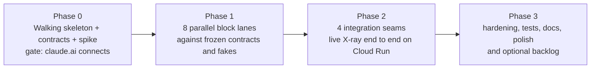

# Build plan

Phases of well-bounded, parallelizable tasks, designed to be handed to AI-agent workflows one task at a time. Each task names its block, its deliverable, the contract it must respect, its dependencies and a definition of done. Task tickets are instantiated from `docs/tasks/TEMPLATE.md` as `docs/tasks/<id>-<slug>.md` (see [REPO_LAYOUT.md](REPO_LAYOUT.md)); the five Phase 0 tickets, the ten block documents (`docs/blocks/*.md`, Status: planned), `docs/contracts/CHANGES.md` and `docs/observations/claude-ai.md` already exist, so the first workflows can be spawned directly.

Identifier prefixes: `A-xx` assumptions and `D-x` user decisions live in [ASSUMPTIONS.md](ASSUMPTIONS.md); `ADR-x` architecture decisions in [ARCHITECTURE.md](ARCHITECTURE.md) section 9.

Global rules for every task:

- Work only inside the paths listed in the ticket; shared paths (`src/contracts`, `src/app.ts`, `package.json`, `CLAUDE.md`) are edited only by tasks that name them.
- Every cross-block dependency is a contract interface consumed through `src/testing/fakes.ts` until integration.
- "Observability is part of done": a feature that does not emit its events is not finished.
- `npm run check` (typecheck, lint, unit tests) must pass in isolation for the block.
- The block document `docs/blocks/<block>.md` is updated (Status / Public interface / Events owned / How to test / Known gaps).

---

## Phase 0 - Walking skeleton (small team, tight sequencing; ends at a hard gate)

Goal: a deployed skeleton that a real claude.ai account connects to, plus frozen contracts and fakes so Phase 1 lanes can start in parallel.

| Id | Block | Deliverable | Contract it must respect | Depends on | Definition of done |
|---|---|---|---|---|---|
| T0.1 | scaffold (`app`, `infra`, root) | Single npm package: `package.json` with exact versions (`@modelcontextprotocol/sdk@1.30.0`, `express@5`, zod per SDK peer range, `better-sqlite3`, `jose`, `vitest`, `tsx`, `typescript`, `eslint`, `prettier`), `tsconfig.json` (strict, ESM), ESLint config with the block import rules, `vitest.config.ts`, `.nvmrc`, `.env.example` (every knob from [DEPLOYMENT.md](DEPLOYMENT.md) section 3), `Makefile`/npm scripts (`dev`, `check`, `test`, `build`), `infra/Dockerfile` (multi-stage, `node:22-slim`, non-root) and `infra/cloudbuild.yaml` (`docker build -f infra/Dockerfile .`), `src/app.ts` with `trust proxy`, serving `/healthz` and a placeholder `/xray/`, `LICENSE` (MIT, D-8) and `THIRD_PARTY_NOTICES.md` (Ramp MIT notice; see [RAMP_REFERENCE.md](RAMP_REFERENCE.md) section 6.3); update the pre-existing `docs/blocks/*.md`, `docs/tasks/TEMPLATE.md`, `docs/contracts/CHANGES.md` and `docs/observations/claude-ai.md` only where the scaffold changes a path or command | [REPO_LAYOUT.md](REPO_LAYOUT.md) | - (lands first) | `npm ci && npm run check` passes on the Mac; `docker build -f infra/Dockerfile .` succeeds; the container answers `/healthz` on `0.0.0.0:$PORT`; a smoke script opens a `better-sqlite3` `:memory:` database inside a `worker_threads` worker (A-39); A-18 and A-39 recorded as validated or amended |
| T0.2 | `contracts` + `testing` | `src/contracts/{events,tools,bank,auth,xray-api,scopes,index}.ts`: `XrayEvent` envelope (with `login_id`) and catalogue (zod), `ToolCatalogEntry` and the full 17-tool catalog with the **published** JSON schema (`rationale` required) and the **lenient** server-side zod schema (`rationale` optional, truncated) per tool, annotations, per-tool redaction deny-lists, listing rule and availability entries (`listed`, `available`, reasons), scope list, `BankCore` (`dataset` / `overlay` layering, Ramp's `{data, page: {next}}` envelope) and `ScratchDb` interfaces (worker-backed, `terminate` on timeout), `AuthContext` (with `login_id`), `ToolContext`, `XrayEmitter`, X-ray HTTP API types, OAuth constants (callback allowlist, `PUBLIC_HOSTS` canonical URL rules, JWT `typ` list), feature flags, rate-limit and cap knob names; `src/testing/fakes.ts` (in-memory fake of every interface, 20 rows per entity); `test/fixtures/events.jsonl` (200-event hand-written session per [XRAY_EVENT_MODEL.md](XRAY_EVENT_MODEL.md) section 8); contract tests (every fixture line validates; every tool passes the catalog-level test, including the lenient-`rationale` case) | [TOOL_CATALOG.md](TOOL_CATALOG.md), [XRAY_EVENT_MODEL.md](XRAY_EVENT_MODEL.md) | T0.1 | Contract tests pass; `docs/contracts/CHANGES.md` has entry v0.1 "frozen for Phase 1"; every block doc lists the interfaces it consumes |
| T0.3 | `mcp` + `auth` (spike) | Hello MCP with the mock AS: `/mcp` via stateless `StreamableHTTPServerTransport` (JSON responses, GET/DELETE 405), bearer gate before the SDK (401 + `WWW-Authenticate` + Ramp body; parses `method`/`params.name` from the body and answers 403 `insufficient_scope` with `resource_metadata` for a `tools/call` lacking its scope), tools registered from the raw published JSON schema (SDK auto-validation bypassed, ADR-8), empty `prompts`/`resources` capabilities with empty lists, PRM at root and `/mcp` derived from `PUBLIC_HOSTS`, `mcpAuthRouter` mounted with `rateLimit: false` on all three option groups and a provider whose `authorize()` redirects to a minimal persona picker (auto-consent, three personas) carrying a signed `txn` JWT, DCR public clients in a bounded LRU, PKCE S256, `resource` audience, signed JWT codes/access/refresh with `jti`/`typ` and the consumed/rotated sets, callback allowlist, `iss` in the redirect, `login_id` cookie, `get_current_user` tool with `rationale`, app-level per-IP limits on `/register`, `/authorize`, `/token` (ADR-16), per-request logging of `MCP-Protocol-Version`, `clientInfo`, `Origin`, `User-Agent` | [ARCHITECTURE.md](ARCHITECTURE.md) section 5; `contracts/auth.ts` | T0.1 (T0.2 for types, may start with stubs) | MCP Inspector completes OAuth and calls the tool locally; a call without `rationale` reaches the handler; a replayed code and a replayed refresh token get `invalid_grant`; the spike also tries (time-boxed) the v2 packages behind the same `src/mcp` interface and records the result |
| T0.4 | `infra` | `infra/bootstrap.sh` (SA, secrets, IAM), `infra/deploy.sh` (exact flags from [DEPLOYMENT.md](DEPLOYMENT.md), `--config infra/cloudbuild.yaml`, `ORIGIN_POLICY=log-only` default, `PUBLIC_HOSTS` and `status.url` correction), `infra/smoke.sh` (Anthropic checklist on both `run.app` hostnames + invariant checks + the 30x `/register` no-429 check + current Origin policy), `infra/local/docker-compose.yml`, `infra/local/cloudflared.md`, `infra/vm/README.md` (alternative only); **deploy the T0.1 skeleton to Cloud Run** | [DEPLOYMENT.md](DEPLOYMENT.md) | T0.1 | `smoke.sh` passes against the live URL (public IPv4, no redirects, `/healthz` 200, invariants hold, both hostnames serve a matching PRM); URL recorded in `docs/observations/claude-ai.md` |
| T0.5 | gate (integrator) | Deploy T0.3 with `deploy.sh` (`log-only`); connect from claude.ai (individual Free/Pro/Max account), Claude Code and MCP Inspector; call `get_current_user`; record protocol version, `clientInfo`, headers, **observed Origin values**, `tools/list` cadence, DCR payload, callback URLs and any reconnect loops in `docs/observations/claude-ai.md`; **switch `ORIGIN_POLICY` to `allowlist`** by re-running `deploy.sh` once the observed Origin values are recorded, and re-run the connection from claude.ai under `allowlist`; decide SDK (1.30.0 vs v2); freeze contracts v0.1 | A-01, A-02, A-03, A-13, A-17, A-34, A-39 | T0.3, T0.4 | claude.ai completes OAuth and a tool call returns under both Origin policies; observations file filled; decisions written to `docs/contracts/CHANGES.md`; Phase 1 tickets created from the template |

Gate rule: no Phase 1 lane starts before T0.5 passes. If claude.ai fails, the fix stays inside `src/mcp` / `src/auth` and the gate is repeated.

---

## Phase 1 - Core blocks in parallel (8 independent lanes)

Every lane depends only on Phase 0 (contracts v0.1 + fakes + fixtures) and is testable alone. Lanes may be merged if fewer agents are available: natural pairs are `bank-core + etl` and `mcp + tools`.

| Id | Block | Deliverable | Contract it must respect | Depends on | Definition of done |
|---|---|---|---|---|---|
| L1 | `bank-core` | Entities; deterministic seed generator (`persona seed -> dataset`; three named personas + generated personas; ~2,000 transactions/persona over 12 months; accounts, cards, transfers, bills, payees; Ramp's 43 categories verbatim); datasets **regenerable on demand from the seed** with an LRU cap on materialised datasets (`MAX_MATERIALISED_PERSONAS`); **copy-on-write overlays per `login_id`** for mutable state (card status, balances, transfers, audit entries; `MAX_PERSONA_OVERLAYS`, `PERSONA_OVERLAY_TTL_HOURS` reset for shared personas, ADR-15); list operations with the `{data, page: {next}}` envelope and filters matching the load tools, reading overlay over dataset; operations `getBalances`, `lockCard`/`unlockCard`, `previewTransfer`, `confirmTransfer` (reprice guard, funds and limit checks), atomic per call; audit entries; `bank.*` events through the emitter interface; currency USD (cents) with ACH / wire / internal rails and neutral English names (D-1) | `contracts/bank.ts`, `contracts/events.ts` | T0.5 | Unit tests incl. a seed snapshot test (same seed -> same dataset), pagination tests, transfer preview/confirm tests, an isolation test (a card locked under login A is active under login B on the same shared persona), LRU eviction and regeneration tests; `docs/blocks/bank-core.md` |
| L2 | `etl` | Port of `memory_db.py` (`storeData`, `processData`, `executeQuery`, `clearTable`, `__` flattening, type inference, `{tool}_{uuid}` names, columns from all rows) plus the guard (ADR-9): per-grant `:memory:` DB **inside a `worker_threads` pool** (SQL by message, `worker.terminate()` on `QUERY_TIMEOUT_MS`), `PRAGMA query_only=1`, `Statement.readonly`, token denylist as the primary ATTACH guard, quoted identifiers, 100-row cap, per-grant table cap, **global scratch-database cap with LRU eviction** (`MAX_SCRATCH_DBS`, `etl.table_evicted`), TTL eviction, concurrent-op limit, hosted-Ramp messages; `etl.*` / `sql.*` events | `contracts/bank.ts` (`ScratchDb`), `contracts/events.ts` | T0.5 | Tests that ATTACH, DETACH, PRAGMA, VACUUM, UPDATE, INSERT, DROP, multi-statement input and unknown tables are rejected; a `WITH RECURSIVE` bomb returns `sql.rejected {reason: timeout}` within `QUERY_TIMEOUT_MS` while an in-process `/healthz` probe keeps answering; cap, global-cap and eviction tests; misleading-message fixes tested; `docs/blocks/etl.md` |
| L3 | `tools` | All 17 handlers as pure functions of `(ToolContext, args)`: published JSON schemas plus lenient zod schemas with descriptions, annotations, `rationale` extraction with the lenient rule (`intent.missing`, truncation flag), Ramp's protocol strings, `isError` wrapper, the registry with the **listing rule** (hide on missing read scope or flag; write tools listed regardless of write scope, ADR-13) and defence-in-depth scope check, the availability table with `listed`/`available` and `content_hash`, the intent classifier (`intent.inferred`), `get_tool_availability`, `get_current_user` with `boot_id`, `xray_get_session_link` (calls a login-bound pairing interface); coded against `BankCore`, `ScratchDb` and `XrayEmitter` fakes | `contracts/tools.ts`, `contracts/scopes.ts`, [TOOL_CATALOG.md](TOOL_CATALOG.md) | T0.5 | Catalog-level test (name <= 64, title, one hint, `openWorldHint:false`, descriptions, `rationale` required in the published schema and optional in the lenient one, deny-lists); per-tool tests against fakes; listing and availability tests for every reason; `docs/blocks/tools.md` |
| L4 | `mcp` | Evolve the spike: per-request `McpServer` built from the registry for the caller's grant with tools registered from the raw published JSON schema (ADR-8), empty `prompts`/`resources` capabilities and lists, `instructions`, xs session manager (idle-gap segmentation, `initialize_count`), bearer gate parsing `method`/`params.name` and answering 403 `insufficient_scope` + `resource_metadata` for a `tools/call` lacking its scope (`auth.stepup.requested`), **per-grant `tools/call` rate limit** (`RATE_LIMIT_GRANT_TOOL_CALLS`, `tool.call.denied {rate_limited}`), instrumentation of every frame (`http.*` with `/24` IP prefix, `session.*`, `catalog.*` with availability and full-array-only-on-hash-change, `tool.*` lifecycle with budget and size, `protocol.*`), Origin/Host policy with `allowlist` / `log-only` and `PUBLIC_HOSTS`, SDK isolation behind `createTransport(deps)` | `contracts/events.ts`, `contracts/auth.ts` (`AuthContext`), `contracts/tools.ts` (registry interface) | T0.5 | Tests with the SDK client over an in-process HTTP server: initialize, tools/list per scope set (write tools present under a read-only grant, read tools hidden when their scope is missing), a `tools/call` without `rationale` reaches the handler, `tools/call` on a listed write tool under a read-only grant gets 403 with the full challenge, tools/call emits the expected event sequence, `prompts/list` and `resources/list` return empty lists without `protocol.error`, 405 on GET/DELETE, 401 shape, rate-limit denial, xs segmentation on simulated idle gaps; `docs/blocks/mcp.md` |
| L5 | `auth` | Full mock AS: persona login page with "create a demo customer" and an "existing `per_` id" field, `login_id` cookie (30 d, signed, `HttpOnly`, `Secure`), consent page (reads pre-checked, writes opt-in, `auth_level` and expiry shown, shared-persona warning, **"extend existing grant"** when the browser holds a grant for the same client), consent success page (persona id, dashboard pairing link), `txn` JWT carrying the authorize parameters through `/login` and `/consent`, `SameSite=Strict` CSRF double-submit, `X-Frame-Options: DENY` and `Content-Security-Policy: frame-ancestors 'none'` on AS pages, signed JWT codes/access/refresh with `jti`/`typ`, rotation and 7 d / 24 h lifetimes, consumed-code and rotated/revoked-refresh sets plus `revoked_grants` (ADR-4), `mockbank_user_tok_` prefix, revocation, `iss`, callback allowlist with port-agnostic loopback, DCR store as a bounded LRU persisted in the `AUTH_DB_PATH` SQLite table with reconstruction to exactly the claude.ai callback plus loopback (`auth.client.reconstructed`, A-12), `PUBLIC_HOSTS`-derived issuer/`resource`/`aud`, `scopes_supported` gated by feature flags, `mcpAuthRouter` with `rateLimit: false`, CIMD flag off, `verifyAccessToken -> AuthContext` (rejects wrong `typ`), `auth.*` events; every endpoint sub-second | `contracts/auth.ts`, `contracts/scopes.ts`, [ARCHITECTURE.md](ARCHITECTURE.md) section 5 | T0.5 | Scripted OAuth walk (DCR -> authorize -> login -> consent -> token -> refresh -> revoke) with PKCE positive and negative cases; replayed code and replayed refresh -> `invalid_grant`; code presented as bearer -> 401; POST without/with mismatched `txn` or CSRF rejected; framing headers present; step-up walk re-issues the same `grant_id` with widened scopes; PRM `resource` follows the request Host for each `PUBLIC_HOSTS` entry; restart simulation (new process, old refresh token still works, unknown client reconstructed); `docs/blocks/auth.md` |
| L6 | `xray` | `XrayEmitter` (non-throwing, bounded queue), deny-list redaction pipeline (arguments verbatim by default, `/24` IP prefix, `anthropic_egress`), monotonic ids with restart continuity, ring buffer, SQLite WAL log with retention, SSE endpoint (filters `xs` / `login=me` / `all`, `Last-Event-ID` replay, heartbeat, `retry`, drop counters), REST read model (sessions grouped by login with grant lineage), pairing codes (**login-bound**, `BANK-XXXX-XXXX-XX`, 24 h, multi-use within TTL), viewer cookie as a signed JWT (`typ: viewer`), per-IP exchange rate limit (5 failures / min), admin observer mode via `POST /xray/api/admin` with extra redaction, `server.started/stopping` with `boot_id`, SIGTERM flush hook; `xray.*` events | `contracts/events.ts`, `contracts/xray-api.ts`, [XRAY_EVENT_MODEL.md](XRAY_EVENT_MODEL.md) | T0.5 | Redaction unit tests (deny-list, token patterns, observer masking); an SSE test that disconnects and reconnects with `Last-Event-ID` and receives no gaps or duplicates; viewer-scoping tests (pairing sees every grant of its login and nothing else; a second exchange of the same code within TTL works; the sixth wrong code in a minute is rate-limited; admin sees all, redacted); viewer JWT survives a simulated restart; `docs/blocks/xray.md` |
| L7 | `dashboard` | `public/` SPA (vanilla JS): the eight panels, `EventSource` client with reconnect and replay cursor, filters, pause/jump-to-live, "now" strip with the 300 s budget, pairing-code entry (`BANK-XXXX-XXXX-XX`), sessions grouped by login with grant lineage and restart markers, `?fixture=1` mode streaming `test/fixtures/events.jsonl`, unknown-event fallback, English-only UI | `contracts/events.ts`, `contracts/xray-api.ts`, [XRAY_EVENT_MODEL.md](XRAY_EVENT_MODEL.md) section 7 | T0.5 | Renders every fixture event without console errors in fixture mode; a small DOM test for the timeline reducer and the availability panel (listed-but-unavailable rendering); `docs/blocks/dashboard.md` with screenshots |
| L8 | `infra` | Harden the scripts: `smoke.sh` invariant assertions (instances, cpu-throttling, timeout, public IAM, PRM on both hostnames, discovery timing < 10 s, `/register` no-429 check, Origin policy printout), local `docker compose` parity with production env (`PUBLIC_HOSTS`, caps), cost note, `docs/runbook.md` skeleton (deploy, rollback, key rotation, pause, Origin policy switch, cap tuning), optional Cloud Build trigger config if Decision D-10 adds a remote | [DEPLOYMENT.md](DEPLOYMENT.md) | T0.5 | `smoke.sh` fails on a deliberately drifted config in a dry run; runbook reviewed; `docs/blocks/infra.md` |

---

## Phase 2 - Integration (4 seams, one integrator per seam; I1 first, then I2-I4 in parallel)

| Id | Seam | Deliverable | Contract it must respect | Depends on | Definition of done |
|---|---|---|---|---|---|
| I1 | Read path + wiring (`app`) | Composition root mounts `auth -> mcp -> xray -> dashboard`; real `bank-core` and `etl` injected into the `tools` registry; `test/e2e/` drives DCR + authorize + token programmatically then the SDK client: initialize, tools/list per scope set, load -> process -> query -> clear, `load_statement_lines`, a rejected SQL statement, an intentionally failing call; MCP Inspector manual pass; apply pending `docs/contracts/CHANGES.md` proposals | all contracts | L1-L6 | e2e green locally; every tool call in the e2e produces the documented event sequence; no cross-block imports outside `app` (lint) |
| I2 | Write path | `lock_or_unlock_card` and `create_transfer` end to end (preview then confirm, reprice rejection, insufficient funds), the write tools listed under a read-only grant, the gate's 403 `insufficient_scope` step-up listing all still-needed scopes with `resource_metadata`, re-consent through "extend existing grant" keeping the same `grant_id` (`auth.grant.updated`), `FEATURE_FLAGS` gating visible in availability, copy-on-write isolation between two logins on a shared persona, audit entries visible as `bank.op` events | [TOOL_CATALOG.md](TOOL_CATALOG.md) sections 2, 3 and 7; ADR-13/14/15 | I1 | e2e cases for both writes, the step-up and the grant extension; Inspector confirms the destructive annotation renders |
| I3 | Live X-ray | Point the SPA at the live API; pairing flow from `xray_get_session_link` (and from the consent success page) to the dashboard; observer mode; heartbeat and replay verified across a forced disconnect; possibility-space panel fed by `catalog.tools_listed` (listed-but-unavailable write tools); intent panel with declared / inferred / missing; correlation chain (login -> grant -> xs -> events) checked against real traffic, including a step-up mid-session that leaves the open dashboard live | [XRAY_EVENT_MODEL.md](XRAY_EVENT_MODEL.md) | I1 (L7 in parallel) | A full local session is watched live end to end; reconnect shows no gap; a second login on the same persona is invisible to the first viewer; the same pairing code works on a second device |
| I4 | Cloud run-through | `deploy.sh` (under `allowlist`), `smoke.sh`, full claude.ai walkthrough (login, consent with a read scope unchecked, read flow, write with prompt, step-up with grant extension, dashboard via pairing link, redeploy showing the restart marker and a reverted card lock), Claude Code and Inspector against the cloud URL on both `run.app` hostnames, record real traffic into `test/fixtures/` (replacing the hand-written fixture), update `docs/observations/claude-ai.md`, verify A-01, A-02, A-05, A-07, A-17, A-27, A-36, A-40, A-41 | [DEPLOYMENT.md](DEPLOYMENT.md) section 5 | I1, I2, I3 | The walkthrough completes from an individual claude.ai account; fixtures and observations committed; the shared-persona banner and missing-rationale badge observed at least once |

---

## Phase 3 - Hardening, tests, docs, polish, and optional backlog (parallel; pick by value)

| Id | Block | Deliverable | Depends on |
|---|---|---|---|
| H1 | `etl`, `mcp`, `xray`, `app` | Security review: SQL guard audit against the ATTACH escape, identifier injection and worker-termination races, redaction audit, **audit of the Phase 0/1 rate limits and caps against real traffic** (tune the knobs; consider a per-login grant cap and cost alerts), Origin policy review from real claude.ai traffic, 150k-character and 300 s budgets enforced and surfaced, SIGTERM under load, browser-page CSRF/framing review | I4 |
| H2 | `auth`, `xray`, `infra` | Restart tolerance: redeploy during an active claude.ai session (tokens survive, re-initialize succeeds, client reconstruction works, the replay window of consumed/revoked sets measured and documented), `server.started` markers and `boot_id` on the dashboard, optional GCS snapshot/restore of the event log (Decision D-6) | I4 |
| H3 | `test/` | Test suite: Inspector CLI scripts for OAuth and every tool, contract tests (schemas versus docs), fixture-driven regression for the dashboard, chaos test (restart -> re-initialize), a full-year load timed inside the 300 s budget | I4 |
| H4 | docs | Generated `docs/contracts/*` from the catalog and event schema, per-block docs finalized, `docs/runbook.md`, demo script, cost sheet | I4 |
| H5 | `dashboard` | Catalog diff between snapshots, raw JSON-RPC/HTTP frame view with JSONL export, mock core-banking audit panel, p50/p95 polish, dark mode, empty and error states | I3 |
| B1 | `auth` | CIMD behind `CIMD_ENABLED` (fetch-and-validate `https://` client ids with SSRF, size and timeout guards; metadata flags) | I4 |
| B2 | `mcp` | Migrate the transport to v2 `createMcpHandler` for dual-era (2026-07-28) support, if not already chosen at the gate | I4 |
| B3 | `xray`, `infra` | Split `xray` into its own Cloud Run service via an `HttpForwarder` emitter adapter; OpenTelemetry exporter from the same emitter | H2 |
| B4 | `tools`, `bank-core` | More writes with Ramp's approval pattern (`approve_or_reject_transfer` with `thoughts` and verbatim `user_reason`, `pay_bill`, `update_card_limit`), attention feed, decline explanation; business-role scoping (Decision D-11) | I2 |
| B5 | `etl` | DuckDB "analyst" read-only layer with catalog -> docs -> SQL gating (`docs_required`), Ramp 2026 pattern | I1 |
| B6 | `auth`, `dashboard` | Dashboard sign-in with the mock IdP (see all logins of a persona); lazy-auth mode with public reference tools | I3 |

---

## Sequencing summary and agent counts

| Phase | Parallelism | Gate |
|---|---|---|
| 0 | T0.1 serial; then T0.2, T0.3, T0.4 in parallel (3 agents); T0.5 by one integrator | claude.ai connects and calls a tool from an individual account |
| 1 | 8 lanes (or 6 with the suggested merges) | every lane green against fakes and fixtures; block docs updated |
| 2 | I1 first (1 agent), then I2, I3, I4 in parallel (3 agents) | full walkthrough on Cloud Run; fixtures recorded |
| 3 | any subset in parallel | none; value-driven |
